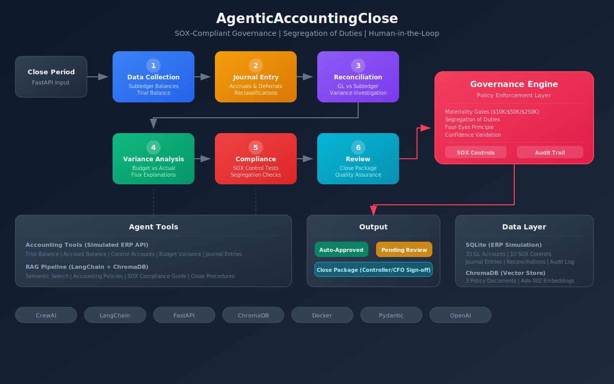

# AgenticAccountingClose

An AI-powered **Month-End Close Assistant** built with a **governance-first** design, **SOX-compliant** controls, **segregation of duties**, and **human-in-the-loop** oversight. Six specialized AI agents work as a sequential pipeline to collect data, prepare journal entries, reconcile accounts, analyze variances, test SOX controls, and generate the close package, all with a full audit trail.

## Architecture



### Agent Pipeline (Sequential Flow)

```
Close Period Initiated
       |
[1. Data Collection Agent]  -- Gathers subledger balances, prepares trial balance
       |
[2. Journal Entry Agent]    -- Prepares adjusting entries (accruals, deferrals, reclasses)
       |
[3. Reconciliation Agent]   -- Matches GL to subledger, identifies discrepancies
       |
[4. Variance Analysis Agent] - Compares actuals to budget, explains material variances
       |
[5. Compliance Agent]       -- SOX controls testing, segregation of duties validation
       |
[6. Review Agent]           -- Final quality review, generates close package summary
       |
[Governance Engine]         -- Materiality gates, HITL escalation, audit trail
       |
Output: Auto-Approved / Pending Human Review / Close Package
```

### Governance-First Design

Every agent decision is logged to an immutable audit trail. The Governance Engine evaluates journal entries against configurable policies:

| Policy | Trigger | Action |
|--------|---------|--------|
| Materiality Gate (L1) | Entry amount > $10,000 | Manager approval required |
| Materiality Gate (L2) | Entry amount > $50,000 | Controller approval required |
| Materiality Gate (L3) | Entry amount > $250,000 | CFO approval required |
| Segregation of Duties | Preparer == Approver | Approval blocked |
| Low Confidence | Agent confidence < 0.7 | Human verification required |
| Reconciliation Variance | Difference > 1% or > $100 | Investigation required |
| Material Flux | Budget variance > 5% or > $25,000 | Explanation required |

### SOX Controls

The system includes 10 automated SOX controls tested against actual data:

| Control ID | Control Name | Type |
|-----------|-------------|------|
| SOX-JE-001 | Journal Entry Authorization | Preventive |
| SOX-JE-002 | Segregation of Duties | Preventive |
| SOX-JE-003 | Non-Standard Journal Entry Review | Detective |
| SOX-REC-001 | Account Reconciliation Completeness | Detective |
| SOX-REC-002 | Reconciliation Review and Approval | Detective |
| SOX-REC-003 | Timely Reconciliation Completion | Detective |
| SOX-VAR-001 | Flux Analysis Review | Detective |
| SOX-ACC-001 | System Access Controls | Preventive |
| SOX-CLS-001 | Close Checklist Completion | Detective |
| SOX-CLS-002 | Management Review of Financial Statements | Detective |

### Human-in-the-Loop Flow

```
Agent creates journal entry
       |
Governance Engine evaluates
       |
   [Materiality Check]
    /         \
Below $10K   Above $10K
   |              |
Auto-approve  Route to approver (L1/L2/L3)
(with log)        |
           Human reviews via API
            /           \
       Approve         Reject
       (SoD check)     (with reason)
           |              |
     Ready to post   Return for revision
```

## Tech Stack

| Component | Technology | Purpose |
|-----------|-----------|---------|
| Multi-Agent Orchestration | CrewAI | Sequential 6-agent pipeline |
| RAG Pipeline | LangChain + ChromaDB | Accounting policy document intelligence |
| Embeddings | OpenAI Ada-002 | Vector embeddings for semantic search |
| LLM | OpenAI GPT-4o-mini | Agent reasoning and analysis |
| API Layer | FastAPI | REST endpoints with Swagger docs |
| Data Validation | Pydantic | Type-safe models with SOX audit fields |
| Database | SQLite | Simulated ERP/GL data store |
| Containerization | Docker | Production-ready deployment |

## Getting Started

### Prerequisites

- Python 3.11 or higher
- OpenAI API key

### Installation

```bash
# Clone the repository
git clone https://github.com/Dewale-A/AgenticAccountingClose.git
cd AgenticAccountingClose

# Create virtual environment
python -m venv venv
source venv/bin/activate  # On Windows: venv\Scripts\activate

# Install dependencies
pip install poetry
poetry install

# Set up environment
cp .env.example .env
# Edit .env and add your OPENAI_API_KEY
```

### Running the Server

```bash
python run_server.py
```

The server starts at `http://localhost:8000`. API documentation is available at `http://localhost:8000/docs`.

### Running with Docker

```bash
# Set your API key
export OPENAI_API_KEY=your-key-here

# Build and run
docker-compose up --build
```

## API Endpoints

### Close Management
| Method | Endpoint | Description |
|--------|----------|-------------|
| POST | `/close/initiate` | Start the close process for a period |
| GET | `/close/status` | Close progress and task checklist |
| GET | `/close/package` | Generate the close package summary |

### Journal Entries
| Method | Endpoint | Description |
|--------|----------|-------------|
| POST | `/journal-entries` | Submit a new journal entry |
| GET | `/journal-entries` | List entries for a period |
| GET | `/journal-entries/{id}` | Entry details with audit trail |
| POST | `/journal-entries/{id}/approve` | Approve (with segregation check) |
| POST | `/journal-entries/{id}/reject` | Reject with reason |

### Reconciliations
| Method | Endpoint | Description |
|--------|----------|-------------|
| GET | `/reconciliations` | List reconciliations for a period |
| GET | `/reconciliations/{id}` | Reconciliation details |
| POST | `/reconciliations/{id}/certify` | Certify (with segregation check) |

### Variance Analysis
| Method | Endpoint | Description |
|--------|----------|-------------|
| GET | `/variance-report` | Budget vs. actual with material flags |

### Human-in-the-Loop Reviews
| Method | Endpoint | Description |
|--------|----------|-------------|
| GET | `/reviews/pending` | Items awaiting human review |

### Governance
| Method | Endpoint | Description |
|--------|----------|-------------|
| GET | `/governance/audit-trail` | Full agent decision audit trail |
| GET | `/governance/dashboard` | Governance overview and stats |
| GET | `/governance/sox-controls` | SOX control status |
| POST | `/governance/sox-tests/run` | Execute SOX control tests |

### System
| Method | Endpoint | Description |
|--------|----------|-------------|
| GET | `/health` | Health check |

## Example: Submit a Journal Entry

```bash
curl -X POST http://localhost:8000/journal-entries \
  -H "Content-Type: application/json" \
  -d '{
    "entry_type": "accrual",
    "description": "Accrue February salaries for 3 working days (Feb 26-28) not yet paid",
    "period": "2026-02",
    "lines": [
      {
        "line_number": 1,
        "account_number": "6000-100",
        "description": "Salary expense accrual (3 days)",
        "debit": 24250.00,
        "credit": 0
      },
      {
        "line_number": 2,
        "account_number": "2100-100",
        "description": "Accrued salaries payable",
        "debit": 0,
        "credit": 24250.00
      }
    ],
    "supporting_documentation": "Payroll register Feb 2026, 3 days at $485K monthly / 20 workdays"
  }'
```

This entry ($24,250) exceeds the L1 threshold ($10,000), so it routes to the Accounting Manager for approval. The governance engine logs the routing decision with full audit trail.

## Project Structure

```
AgenticAccountingClose/
├── README.md                          # You are here
├── docs/
│   ├── architecture.svg               # System architecture diagram (V2)
│   ├── architecture.png               # Rendered PNG version
│   └── PROJECT_OVERVIEW.md            # Project story and design rationale
├── src/
│   ├── agents/
│   │   └── definitions.py             # 6 agent definitions (role, goal, backstory)
│   ├── tasks/
│   │   └── definitions.py             # Task templates parameterized by close period
│   ├── tools/
│   │   ├── accounting_tools.py        # ERP/GL query tools (trial balance, recon, etc.)
│   │   └── rag_tools.py              # RAG search tools (LangChain + ChromaDB)
│   ├── data/
│   │   └── database.py               # SQLite setup, seed data, query helpers
│   ├── docs/                          # Accounting policy documents for RAG
│   │   ├── accounting_policies.md     # Revenue recognition, accruals, depreciation
│   │   ├── sox_compliance_guide.md    # Section 302/404, control testing, deficiencies
│   │   └── close_procedures.md        # Close calendar, checklist, JE procedures
│   ├── models/
│   │   └── schemas.py                 # Pydantic models with SOX audit fields
│   ├── governance/
│   │   ├── engine.py                  # Governance engine (materiality, SoD, HITL)
│   │   └── sox_controls.py            # Automated SOX control testing
│   ├── api/
│   │   └── routes.py                  # FastAPI endpoints
│   └── crew.py                        # Crew orchestration (ties everything together)
├── run_server.py                      # Server launcher
├── Dockerfile                         # Container build
├── docker-compose.yml                 # Container orchestration
├── pyproject.toml                     # Dependencies
└── .env.example                       # Environment template
```

## Key Design Decisions

1. **Governance-First**: The governance engine is a core component, not an afterthought. Every journal entry passes through materiality gates. Every approval checks segregation of duties. Every decision is logged. This mirrors how responsible AI should be deployed in regulated financial environments.

2. **SOX Compliance Built In**: 10 automated controls are tested against actual data. The system produces evidence that auditors can review: test results, sample sizes, exceptions, and conclusions. AI decisions are treated with the same rigor as human decisions.

3. **Segregation of Duties**: The system enforces that the person who prepares a journal entry cannot approve it. This is not just a recommendation. It is enforced at the API level and tested as a SOX control.

4. **Four-Eyes Principle**: Material items require at least two people (or one agent and one human) to review before posting. The threshold is configurable: start conservative ($10K), increase as trust builds.

5. **Confidence-Based Escalation**: When an agent is uncertain (confidence < 0.7), it escalates to a human rather than proceeding with a potentially wrong decision. This is the responsible way to deploy AI in finance.

6. **Sequential Pipeline**: Agents run in strict order because each depends on the previous one's output. You cannot reconcile accounts without the trial balance. You cannot test SOX controls without journal entries and reconciliations.

7. **Tools as Plain Functions**: Accounting tools and RAG tools are plain Python functions. The @tool decorator is applied only in crew.py. This keeps tools testable, reusable in the API, and decoupled from CrewAI.

8. **Simulated ERP**: SQLite simulates a real ERP (NetSuite, SAP) so the project runs without external dependencies. In production, swap the database queries with ERP API calls.

## Simulated Data

The database is seeded with realistic month-end close data:

- **33 GL accounts** across assets, liabilities, equity, revenue, and expenses
- **Intentional discrepancies** for agents to discover:
  - Cash: $3,245 GL/bank difference (outstanding checks)
  - Accounts Receivable: $12,500 variance (unapplied payment)
  - Accounts Payable: $8,750 variance (unprocessed invoices)
  - Inventory: $5,200 variance (count adjustment needed)
- **10 SOX controls** with testing procedures
- **8 close tasks** in the month-end checklist
- **3 policy documents** for the RAG pipeline (accounting policies, SOX guide, close procedures)

## Production Considerations

This project demonstrates agentic AI architecture patterns for regulated accounting environments. For production deployment, the following enhancements would be required:

**Authentication and Authorization**
- Integrate with identity provider (Azure AD, Okta, or similar)
- Implement role-based access control (RBAC) on all API endpoints
- Bind segregation of duties enforcement to authenticated identities rather than string names
- Add API key or OAuth2 token validation

**Data Layer**
- Replace SQLite with PostgreSQL for concurrent access and production reliability
- Implement connection pooling
- Add database migrations (Alembic)
- Connect to actual ERP systems (NetSuite, SAP, Snowflake) via API instead of simulated data

**Agent Output Reliability**
- Use CrewAI structured output (Pydantic output models) for deterministic agent responses
- Implement output validation and retry logic for malformed agent responses
- Add fallback handling when LLM API calls fail or timeout

**Observability**
- Structured logging (JSON format) with correlation IDs per close period
- Metrics collection (Prometheus) for agent processing times and success rates
- Alerting on failed SOX control tests or governance policy violations
- Dashboard integration (Grafana) for real-time close progress monitoring

**Testing**
- Expand test suite to cover all agent interactions
- Add integration tests with mocked LLM responses
- Implement contract tests for API endpoints
- Add load testing for concurrent close processing

**Financial Precision**
- Use Python Decimal type for all monetary calculations
- Implement configurable rounding rules per accounting standard
- Add multi-currency support with exchange rate management

## License

MIT
